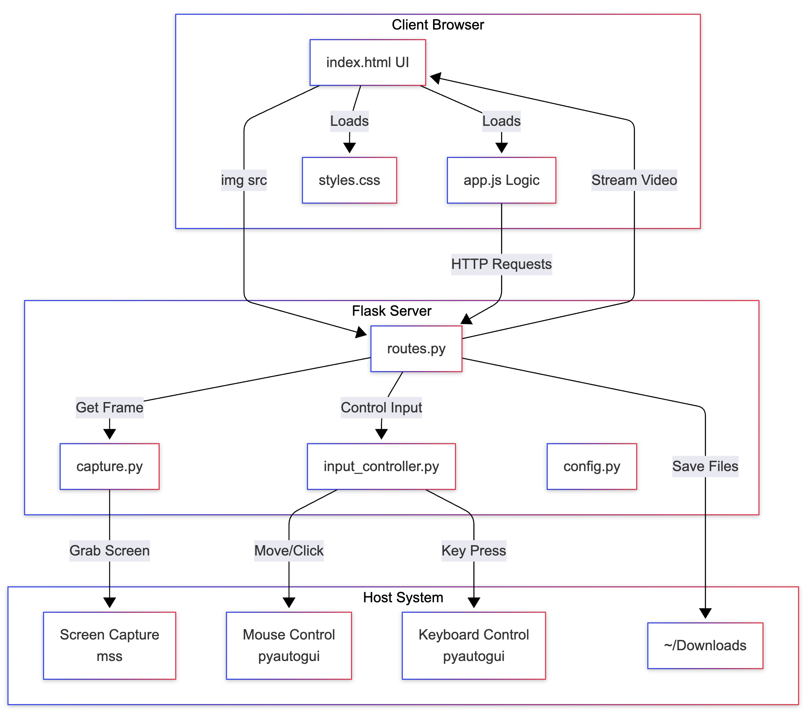

# Remote Access

A simple web-based remote desktop application that allows you to control your computer through a browser.
This project was done to learn basic webdev with Flask.

## Features

- Real-time screen streaming
- Mouse and keyboard control
- File upload to server
- Web-based interface

## System Architecture



The application follows a three-tier architecture:
- **Client Browser**: HTML/CSS/JS interface for user interaction
- **Flask Server**: Python backend handling routing, capture, and input control
- **Host System**: Screen capture (mss) and input control (pyautogui)

## Requirements

- Python 3.x
- Works on **Windows, macOS, and Linux**

> **Note**: The current `requirements.txt` includes macOS-specific dependencies (`pyobjc`). For Windows/Linux, you may need to remove these lines and install only the core dependencies (`Flask`, `mss`, `Pillow`, `pyautogui`).

## Installation

1. Clone the repository
2. Install dependencies:
```bash
pip install -r requirements.txt
```

## Usage

1. Start the server:
```bash
python run_server.py
```

2. Open your browser and navigate to:
```
http://127.0.0.1:5001
```

## Configuration

Edit `server/config.py` to customize:
- `HOST` - Server host (use `0.0.0.0` for network access)
- `PORT` - Server port (default: 5001)
- `FPS` - Stream frame rate (default: 60)
- `IMAGE_QUALITY` - JPEG quality (default: 30)
- `SCALE` - Screen scale factor (default: 0.5)
- `UPLOAD_FOLDER` - File upload destination (default: ~/Downloads)

## Project Structure

```
remote-access/
├── client/          # Frontend files (HTML, CSS, JS)
├── server/          # Backend Flask application
├── run_server.py    # Server entry point
├── architecture.png # Architecture image
├── LICENSE          # License file
├── README.md        # README file
├── .gitignore       # gitignore file
└── requirements.txt # Python dependencies
```

## Technology Stack
### Backend
- Flask: Web framework
- mss: Fast screen capture
- Pillow (PIL): Image processing
- pyautogui: Mouse/keyboard control
### Frontend
- Vanilla JavaScript: No frameworks
- CSS3: Modern styling with Inter font
- HTML5: Semantic markup
### Communication
- HTTP/1.1: Request/response
- Multipart JPEG: Video streaming
- JSON: API payloads
